# Munder Difflin Paper Company - Multi-Agent Workflow Diagram

## System Overview

The system uses an **orchestrator-worker pattern** built with the [smolagents](https://github.com/huggingface/smolagents) framework. A single Orchestrator agent receives all customer inquiries and delegates work to three specialized worker agents, each equipped with purpose-built tools that wrap the project's helper functions.

## Agent Workflow Diagram

```mermaid
graph TD
    Customer["Customer Inquiry<br/>(from quote_requests_sample.csv)"]
    Orch["Orchestrator Agent<br/>(Claude Sonnet / gpt-4o)<br/>ToolCallingAgent, max_steps=8"]

    Customer --> Orch

    subgraph Orchestration Logic
        Parse["1. Parse request:<br/>identify items, quantities, dates"]
        Map["2. Map descriptions to<br/>exact catalog item names"]
        CheckInv["3. Check inventory availability"]
        Quote["4. Generate quote with discounts"]
        Sell["5. Process sale transaction"]
        Decline["6. Decline unavailable items<br/>with customer-friendly explanation"]
    end

    Orch --> Parse --> Map --> CheckInv
    CheckInv -->|In stock| Quote --> Sell
    CheckInv -->|Out of stock| Decline

    subgraph inventory_agent ["Inventory Agent (Claude Haiku / gpt-4o-mini, max_steps=3)"]
        T1["check_inventory_item<br/>&#8594; get_stock_level()"]
        T2["check_all_inventory<br/>&#8594; get_all_inventory()"]
        T3["check_supplier_delivery<br/>&#8594; get_supplier_delivery_date()"]
    end

    subgraph quoting_agent ["Quoting Agent (Claude Haiku / gpt-4o-mini, max_steps=3)"]
        T4["calculate_quote<br/>&#8594; get_stock_level() + paper_supplies catalog"]
        T5["search_past_quotes<br/>&#8594; search_quote_history()"]
        T6["get_financial_report_tool<br/>&#8594; generate_financial_report()"]
    end

    subgraph sales_agent ["Sales Agent (Claude Haiku / gpt-4o-mini, max_steps=3)"]
        T7["process_sale<br/>&#8594; get_stock_level() + create_transaction()"]
        T8["check_cash_balance<br/>&#8594; get_cash_balance()"]
        T9["process_restock_order<br/>&#8594; get_cash_balance() + create_transaction()<br/>+ get_supplier_delivery_date()"]
    end

    CheckInv -.->|"delegates to"| inventory_agent
    Quote -.->|"delegates to"| quoting_agent
    Sell -.->|"delegates to"| sales_agent

    subgraph DB ["SQLite Database (munder_difflin.db)"]
        Inv[(inventory)]
        Txn[(transactions)]
        Q[(quotes)]
        QR[(quote_requests)]
    end

    T1 --> Inv
    T1 --> Txn
    T2 --> Inv
    T2 --> Txn
    T3 -.->|"calculates lead time"| T3
    T4 --> Inv
    T4 --> Txn
    T5 --> Q
    T5 --> QR
    T6 --> Inv
    T6 --> Txn
    T7 --> Inv
    T7 --> Txn
    T8 --> Txn
    T9 --> Txn

    Sell --> Response["Customer-Facing Response<br/>(rationale included,<br/>internal data hidden)"]
    Decline --> Response
    Response --> Results["test_results.csv"]
```

## Agent Details

### Orchestrator Agent
| Property | Value |
|---|---|
| Model | Claude Sonnet 4 (or gpt-4o via Vocareum) |
| Type | `ToolCallingAgent` |
| Max Steps | 8 |
| Direct Tools | None |
| Managed Agents | `inventory_agent`, `quoting_agent`, `sales_agent` |

**Responsibilities:** Parses customer requests, maps natural-language product descriptions to exact catalog names, orchestrates the check-quote-sell workflow, and composes customer-facing responses that include rationale but hide internal data (margins, errors, cost prices).

### Inventory Agent
| Property | Value |
|---|---|
| Model | Claude Haiku 4.5 (or gpt-4o-mini via Vocareum) |
| Type | `ToolCallingAgent` |
| Max Steps | 3 |

| Tool | Purpose | Helper Function(s) |
|---|---|---|
| `check_inventory_item` | Check stock level of a specific item | `get_stock_level()` |
| `check_all_inventory` | List all items currently in stock | `get_all_inventory()` |
| `check_supplier_delivery` | Estimate delivery date for a restock order | `get_supplier_delivery_date()` |

### Quoting Agent
| Property | Value |
|---|---|
| Model | Claude Haiku 4.5 (or gpt-4o-mini via Vocareum) |
| Type | `ToolCallingAgent` |
| Max Steps | 3 |

| Tool | Purpose | Helper Function(s) |
|---|---|---|
| `calculate_quote` | Generate a price quote with bulk discounts | `get_stock_level()` + `paper_supplies` catalog |
| `search_past_quotes` | Search historical quote data by keywords | `search_quote_history()` |
| `get_financial_report_tool` | Generate financial report (cash, inventory, top sellers) | `generate_financial_report()` |

### Sales Agent
| Property | Value |
|---|---|
| Model | Claude Haiku 4.5 (or gpt-4o-mini via Vocareum) |
| Type | `ToolCallingAgent` |
| Max Steps | 3 |

| Tool | Purpose | Helper Function(s) |
|---|---|---|
| `process_sale` | Validate stock, apply discounts, record sale transaction | `get_stock_level()` + `create_transaction()` |
| `check_cash_balance` | Check the company's current cash balance | `get_cash_balance()` |
| `process_restock_order` | Place a restock order from supplier | `get_cash_balance()` + `create_transaction()` + `get_supplier_delivery_date()` |

## Helper Function Usage Summary

All required helper functions are used by the agent tools:

| Helper Function | Used By Tool(s) |
|---|---|
| `get_stock_level()` | `check_inventory_item`, `calculate_quote`, `process_sale` |
| `get_all_inventory()` | `check_all_inventory` |
| `get_supplier_delivery_date()` | `check_supplier_delivery`, `process_restock_order` |
| `search_quote_history()` | `search_past_quotes` |
| `generate_financial_report()` | `get_financial_report_tool` |
| `get_cash_balance()` | `check_cash_balance`, `process_restock_order` |
| `create_transaction()` | `process_sale`, `process_restock_order` |

## Data Flow

1. **Input:** Customer requests loaded from `quote_requests_sample.csv` (20 test scenarios)
2. **Processing:** Orchestrator routes each request through the inventory -> quote -> sale pipeline
3. **State:** SQLite database tracks inventory levels, transactions, and cash balance across requests
4. **Output:** Results written to `test_results.csv` with request ID, date, cash balance, inventory value, and customer-facing response
